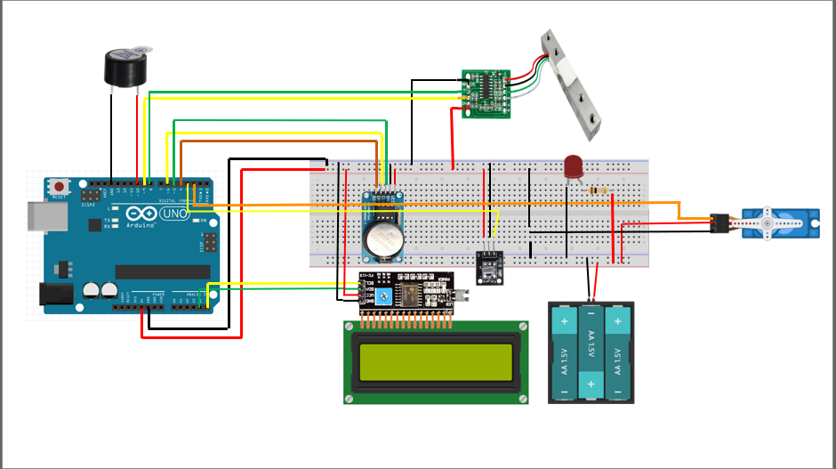

 ## Materiales hasta el momento:

**Principales: **

* Arduino Uno
* Modulo de reloj DS1302 con librería <virtuabotixRTC.h>
* Sensor infrarrojo y control remoto
* Servomotor MG995 (Necesita alimentación externa)
* Pantalla LCD  con modulo I2C
* Modulo de marga y sensor HX711. **Notas:**
	* **Librería extraída de:** https://github.com/bogde/HX711 
	* **Leer ejemplo de:** https://naylampmechatronics.com/blog/25_tutorial-trasmisor-de-celda-de-carga-hx711-ba.html y checar las plantillas de ejemplo que puedes encontrar en los archivos de la librería, esto para adaptar código que muestra naylampmechatronics dado que esta desactualizada la información de la pagina, basarse en el ejemplo HX711_basic_example de la librería, solo es modificar unas cuantas líneas para hacerlo funcionar con el código de naylampmechatronics)
  * Información adicional:
  	* https://www.youtube.com/watch?v=6LyJMymRadQ
  	* https://www.youtube.com/watch?v=MpITkBA50k8
* Buzzer

**Adicionales: **

* Protoboard
* Led: solo para comprobar si esta recibiendo corriente el servomotor.
* Resistencia 220 ohms.

**Diagrama Eléctrico:**

---

**Descripción:** al momento ya es posible....

* Dar comandos mediante control infrarrojo

* Es posible programar hasta 3 alarmas para alimentar a nuestra mascota (Presionando el botón * para configurar)

* Es posible modificar la hora de nuestro reloj (Presionando el botón # para configurar)

* Es posible establecer la cantidad en gramos de comida a dispensar. (Presionando el botón 0 para configurar)

* Es posible usar el display LCD para interactuar con el sistema.

* Al momento de llegarse el tiempo de alimentar a nuestra mascota, nuestro proyecto avisa haciendo unos pitidos por medio de nuestro buzzer.

* La cantidad de alimento ahora es coordinada por medio de el modulo de carga, de manera que este verifica la cantidad de comida que esta siendo dispensada, cerrando la compuerta una vez que se a alcanzado la cantidad en gramos de comida configurada.

* Ya es posible guardar las alarmas y la cantidad en gramos de comida a dispensar sin que se borre la información ante un corte de energía (Se utiliza la EEPROM desde la celda 0 a la 7).
	* **Celda 0:**  Detecta si es la primera inicialización del arduino, por primera vez.
	* **Celda 1 y Celda 2:** Hora y Minutos correspondientemente para la Alarma 1. 
	* **Celda 3 y Celda 4:** Hora y Minutos correspondientemente para la Alarma 2. 
	* **Celda 5 y Celda 6:** Hora y Minutos correspondientemente para la Alarma 3. 
	* **Celda 7:** almacena la cantidad en gramos de comida a dispensar.
	
	
	
	

